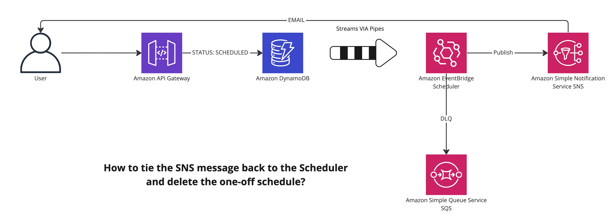

# Reminders Application

## Learnings

- I thought I could skip the API Gateway to DDB VTL transformation via the EventBridge Pipes, but that is not the case.

  - Thinking about it a bit more, it does make sense that the functionality is not there. How would the EventBridge Pipes know that this particular invocation of API Gateway is the one to use as a target?

- I decided to put the data related to schedules first to DDB and then invoke the EventBridge scheduler.

  - Looking at the API of the EventBridge Scheduler, it does not support sorting and filtering (only available client-side).

- For some reason, I had a corrupted rust installation. The `cargo build` worked as expected, but the `lambda build` did not.

  - I had to uninstall rust (installed via brew ??) and re-install it.

- I wish the AWS SAM had some abstraction for direct APIGW integrations.

  - On the other hand, it is pretty good to write those by hand once in a while. It makes you appreciate how much CDK is doing for you!

  - A good example: **to deploy the REST API using the CFN, you must set a `DependsOn` in a specific place**. [Here is the reference](https://stackoverflow.com/questions/56944526/cloudformation-stack-errors-with-rest-api-doesnt-contain-any-methods).

- While playing around with the "native" `ApiGateway` resource, I'm reminded that I must **manually trigger API deployment**.

  - If you use a framework, it will do that for you – most likely append a hash to the `AWS::ApiGateway::Deployment` resource logicalId for CFN to re-create it.

    - Since I'm using the raw CFN, the SAM will not do that for me. Luckily one can use **CFN macros** to append that hash to the logicalId of the `AWS::ApiGateway::Deployment` resource.

- The **DynamoDB `PutItem` operation does not allow you to get the item you have just created back**. A bit weird of a limitation if you ask me.

  - It is a problem because **you cannot get the payload sent to the API in the `IntegrationResponses` mapping template of the API Gateway**.

    - The **workaround is to use the `UpdateItem` with the `ALL_NEW` return values**. Then you should be able to get what you put into the DDB. Not ideal, but better than returning no data.

- I was **pleasantly surprised to discover that the Pipes interface links directly to different source/target/enrichment resources**.

  - Other service UIs lack this essential feature.

- As for the **IAM-related stuff, it would be nice to have a separate policy for each "stage" of the pipe**.

  - Currently, **the only option is creating a single policy encompassing all "stages"**. That is a lot of permissions.

  - I favor granular IAM permissions, which are impossible to achieve here.

- Rust is quite different in GO because **the type of the event denotes how it is parsed**.

  - I've tried to use the APIGW event type (via the `lambda_http` crate) to parse incoming CloudWatch Pipes events. This resulted in runtime errors.

- It is quite neat that you can use `Value` from the `serde_json` package to denote any valid json value.

- It **took me much longer than I would like to admit to get the DDB stream handler enricher working**.

  - For some reason, when I specified the wrong event type, the function silently swallowed errors, even when I was using `unwrap`.

  - The `Value` type denoting generic JSON is very useful. It helped me to debug the issue.

- I **could not find a way to directly invoke the EventBridge Scheduler from the EventBridge Pipes or StepFunctions**.

  - I suspect such integration will be available soon, but it is a pity that I cannot do it now. I have to use a Lambda function to perform the API call.

- I **could not find a way to specify the retries options for the EventBridge Pipes via CFN**.

  - There are _source_ and _target_ parameters, but how do I specify the global retries options (the pipe options in the console)?

- Keep in mind that **if the source of the EventBridge pipe supports batching, the target data will keep the outer array**.

  - I was a bit surprised at first, but then when thinking about it more, it made sense to me, especially when the source is a DynamoDB stream.

- Wow, the **request signing is pretty hard to do in Rust**.

  - Of course, part of the difficulty is my lack of knowledge regarding the language.

- The lambda responsible for creating the schedule had to have the **`iam:PassRole` permission**.

  - This makes sense as the lambda literally passes the _RoleArn_ into the payload, which the scheduler assumes.

  - **In this particular context, the `iam:PassRole` refers to the fact that the _scheduler_ will assume the `RoleArn` for the identity called when `createSchedule`**. Since I'm creating the schedule in AWS Lambda, it is the AWS Lambda execution role that needs to allow for that.

  - Note that the `iam:PassRole` is not related to _service roles__. These are "pre-canned" roles needed for a given service to operate. There are no "dynamic" elements associated with that role.

- Is there not an easy way to delete the AWS Scheduler one-time schedules?

  - **That indeed seems to be the case**. AWS is "looking to make it better". [Source](https://www.reddit.com/r/aws/comments/yxqna2/eventbridge_scheduler_auto_delete_scheduled_events/).

  - My **initial idea was to use the SNS delivery status messages**. The plan was to get the schedule name from the message attributes and delete the schedule.

    - Sadly **the SNS delivery status messages are NOT supported in CFN. They CAN NOT contain the message attributes**. This makes them a bit useless for my use case.

    - The **EventBridge Scheduler _describe_ API calls do not return any information if the target invocation was successful**. This is yet another factor that makes it challenging to create a holistic view of the state of the schedules.
